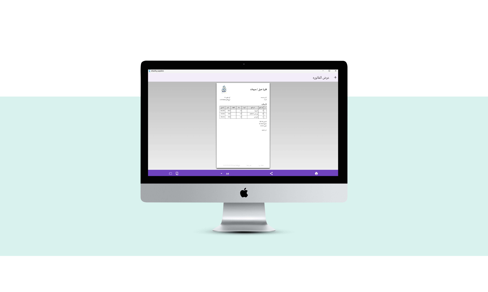

# 📱 eltawfiq_suppliers

📱 About the App
Al-Tawfiq Sales and Inventory Management System is a comprehensive solution designed for retail businesses to efficiently manage inventory, sales operations, suppliers, and invoices.
The app simplifies daily operations, improves stock tracking accuracy, and provides insightful reports to help store owners make better business decisions.

---

## 📸 Screenshots

  
  
  
  
  
  
  
  
  
  

---

## 🚀 Features

Manage products in the inventory (Add / Edit / Delete).

Record daily sales and instantly generate customer invoices.

Manage supplier information (Add / Edit / Delete suppliers).

Create and track purchase invoices from suppliers.

View detailed reports on sales, purchases, and inventory levels.

Fast search functionality for products, suppliers, and invoices.

Track payments received from customers and payments made to suppliers.

Simple and user-friendly interface for easy navigation.

- ...

---

## 🛠️ Tech Stack

- Flutter
- Dart
- Provider 
-  http
-  get_it
-  cached_network_image
-  cached_memory_image
-  image_picker
-  image
-  path_provider
-  path:
- whatsapp_unilink
-  url_launcher
-  flutter_barcode_scanner
-  barcode_widget
-  reorderable_grid_view
-  flutter_speed_dial
-  flutter_contacts
-  permission_handler
-  flutter_typeahead
-  equatable
-  data_connection_checker_nulls
-  dartz
-  sidebarx
-  printing
-  pdf
-  intl
-  carousel_slider
-  shared_preferences
-  another_flutter_splash_screen
-  flutter_textfield_autocomplete
-  flutter_switch
-  share_plus

---

## 📩 Contact

لو عندك أي استفسار أو اقتراح:  
[ahmedhanydeveloper@gmail.com] | [https://www.linkedin.com/in/ahmed-hany-801173357/] 
